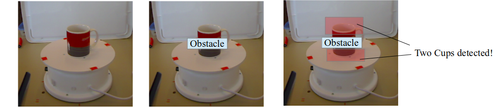
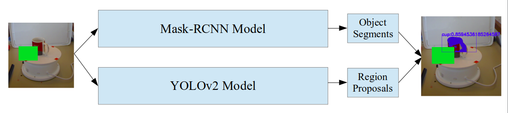

# Occluded Object Detection Using Segmentation

This project was submitted in iHack Hackathon at IIT Bombay 2019

The whole idea of the project is to detect an object whether it is covered by any obstacle or clearly visible. We propose a solution using a combination of Deep-Mask and YOLOv2.

YOLOv2 or such similar networks are good for complete object detection, whereas Mask-RCNN model is good in segment detection, therefore a combination of these can be used for detection of an occluded object.

Incase where multiple objects exists overlapping each other, Depth images can be used to find which object is on top/front of another object.

## Issues

 - Traditional methods include object detection based on region-proposals and localization but they fail if object is occluded.

 - Using only Mask-RCNN for object detection may lead to multiple detection of same object.

  

## Pipeline

  

## Dataset

Mask-RCNN and YOLOv2, both networks were trained on [Microsoft Kinet RGB-D](http://rgbd-dataset.cs.washington.edu/index.html) dataset containing 548 images of a Coffee Cup.

## Applications:

 - Relative distance of object from each other (3D Estimation)
 
 - Object Detection (Person detection) in crowded scenarios
 
 - Estimation of object count (For example how many people have attended an event based on crowd images)

## Usage:
Download the Complete Project

	git clone https://github.com/jatinmandav/Mask-YOLO

Navigate to Mask-YOLO Directory

	cd Mask-YOLO

Download Mask-RCNN and YOLO trained weights from release and extract inside Mask-YOLO Directory.

For Predicting on new image:

	  usage: predict.py [-h] --weights /path/to/weights.h5 --image path or URL to
                  image

    Detect coffee_cups with MaskRCNN+YOLO Network

    optional arguments:
      -h, --help            show this help message and exit
      --weights /path/to/weights.h5
                        Path to weights .h5 file
      --image path to image
	
To Train on your custom dataset, prepare the dataset and use train_mask.py to train Mask-RCNN and follow ([Thtrieu's Darkflow](https://github.com/thtrieu/darkflow)

    usage: train_mask.py [-h] --dataset /path/to/coffee_cup/dataset/ --weights
                         /path/to/weights.h5 [--logs /path/to/logs/]

    Train Mask R-CNN to detect Coffee Cup.

    optional arguments:
      -h, --help            show this help message and exit
      --dataset /path/to/coffee_cup/dataset/
                            Directory of the coffee_cup dataset
      --weights /path/to/weights.h5
                            Path to weights .h5 file or 'coco'
      --logs /path/to/logs/
                            Logs and checkpoints directory (default=logs/)

This project is based on the work of [Thtrieu's Darkflow](https://github.com/thtrieu/darkflow) and [Matterport's Mask-RCNN](https://github.com/matterport/Mask_RCNN)

## Sample Outputs

  
  

  
  

  
  
  

  
  
  

  
  
  

